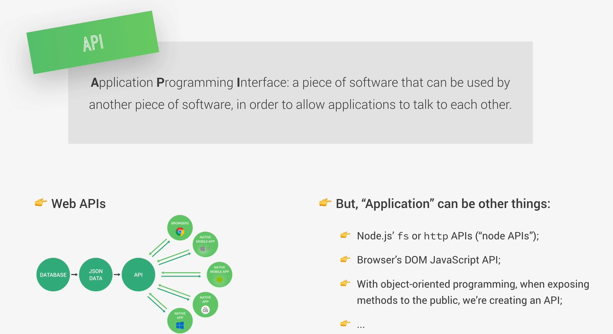

# API (Application Programming Interface)



Una API es básicamente:

- Una forma de que dos programas se comuniquen

Algo como esto:

- Nosotros no hablamos directamente con la base de datos
- Nosotros hablamos con una API
- La API habla con la base de datos por nosotros

## 1. Lo que dice la imagen

- **“Un software que puede ser usado por otro software para permitir que se comuniquen”**

O sea:

- Un programa expone funciones/datos

- Otro programa las usa

## 2. Lo de “Web APIs” en la imagen

Esto significa APIs que funcionan por internet usando HTTP:

Ejemplo:

```
GET /users
POST /login
```

- Esto es lo que hacemos con [Express](../02_node_funcionamiento/09.%20express.md)

## 3. Lo importante: “Application puede ser otras cosas”

Una API **no siempre es web**

También puede ser:

### 3.1 API´s de Node

``` javascript
const fs = require('fs')
fs.readFile(...)
```

- Eso ya es una API (la de Node)

### 3.2 API del navegador (DOM)

``` javascript
document.querySelector('h1')
```

- El navegador nos da funciones → eso es una API

### 3.3 En Programación Orientada a Objetos

``` javascript
class Usuario {
  login() {}
  logout() {}
}
```

- Los métodos públicos = nuestra API

## Resumen

- API = forma de comunicación entre programas

- No solo es HTTP (aunque es lo más común)

- En Express → nosotros creamos APIs web

- En Node → usamos APIs internas

- En el navegador → usamos APIs del DOM