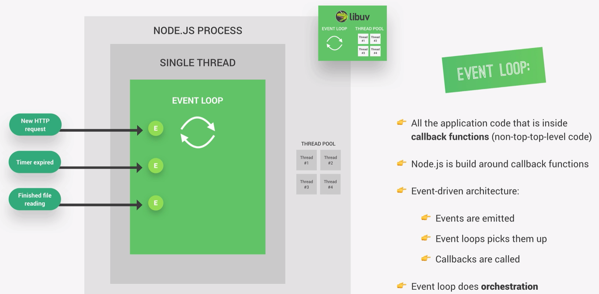

# Event Loop



# 1. “All the application code inside callback functions (non-top-level code)”

Hay dos tipos de código en **Node.js**:

- **Top-level code**

    - Es el código que se ejecuta inmediatamente cuando inicia el programa.

``` javascript
console.log("Hola");

setTimeout(() => {
  console.log("Timer terminado");
}, 1000);
```

El `console.log("Hola")` es **top-level** code porque se ejecuta inmediatamente.

- **Non-top-level code** (callback functions)

Es el código dentro de **callbacks**, que **no se ejecuta inmediatamente**, sino **cuando ocurre un evento**.

``` javascript
setTimeout(() => {
  console.log("Timer terminado");
}, 1000);
```

La función:

``` javascript
() => {
  console.log("Timer terminado");
}
```
es un **callback**.
Ese código lo ejecutará el **event loop después**.

**Por eso**:

- “All the application code is inside callback functions”

Porque mucho del **código real de Node vive dentro de callbacks**.

# 2. “Node.js is built around callback functions”

**Node** está diseñado para trabajar con operaciones asíncronas:

- leer archivos

- recibir requests HTTP

- consultas a bases de datos

- timers

- eventos

En lugar de bloquear el programa, **Node** hace esto:

- Inicia la operación

- Continúa ejecutando otras cosas

- Cuando termina la operación → ejecuta el **callback**

Ejemplo:

``` javascript

fs.readFile("file.txt", (err, data) => {
  console.log("Archivo leído");
});
```

**Node no se queda esperando** a que el archivo termine.

# 3. Event-driven architecture

La arquitectura de **Node es event-driven** (basada en eventos).

El flujo es así:

## 3.1 Events are emitted

Algo ocurre en el sistema:

- termina un timer

- llega una request HTTP

- termina de leerse un archivo

- llega data de la red

Eso genera un evento.

## 3.2 Event loop picks them up

El **Event Loop** está constantemente revisando:

“¿Hay eventos listos?”

Cuando encuentra uno, lo toma.

## 3.3 Callbacks are called

El **Event Loop** ejecuta el **callback** asociado al evento.

Ejemplo:

``` javascript
setTimeout(() => {
  console.log("Timer listo");
}, 1000);
```

### Así ocurre todo

Después de 1 segundo:

1. se emite el evento
2. el event loop lo detecta
3. ejecuta el callback

# 4. “Event loop does orchestration”

La palabra **orchestration** significa:

### coordinar todo

El **Event Loop** coordina:

- timers

- I/O (archivos, red)

- callbacks

- promises

- requests HTTP

El **Event Loop** decide:

- qué callback ejecutar primero

# Visualización
```

Call Stack
   │
   │
Event Loop
   │
   ▼
Callback Queue
   │
   ├── Timer callback
   ├── File read callback
   └── HTTP request callback

```
# Resumen

La imagen dice básicamente esto:

1. Node usa arquitectura event-driven

2. Muchas operaciones son asíncronas

3. Cuando ocurre algo → se genera un evento

4. El Event Loop lo detecta

5. El Event Loop ejecuta el callback asociado