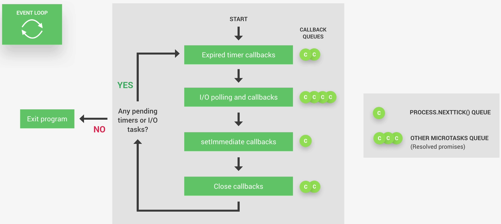

# Event Loop


# 1. “All the application code inside callback functions (non-top-level code)”

Hay dos tipos de código en **Node.js**:

- **Top-level code**

    - Es el código que se ejecuta inmediatamente cuando inicia el programa.

``` javascript
console.log("Hola");

setTimeout(() => {
  console.log("Timer terminado");
}, 1000);
```

El `console.log("Hola")` es **top-level** code porque se ejecuta inmediatamente.

- **Non-top-level code** (callback functions)

Es el código dentro de **callbacks**, que **no se ejecuta inmediatamente**, sino **cuando ocurre un evento**.

``` javascript
setTimeout(() => {
  console.log("Timer terminado");
}, 1000);
```

La función:

``` javascript
() => {
  console.log("Timer terminado");
}
```
es un **callback**.
Ese código lo ejecutará el **event loop después**.

**Por eso**:

- “All the application code is inside callback functions”

Porque mucho del **código real de Node vive dentro de callbacks**.

# 2. “Node.js is built around callback functions”

**Node** está diseñado para trabajar con operaciones asíncronas:

- leer archivos

- recibir requests HTTP

- consultas a bases de datos

- timers

- eventos

En lugar de bloquear el programa, **Node** hace esto:

- Inicia la operación

- Continúa ejecutando otras cosas

- Cuando termina la operación → ejecuta el **callback**

Ejemplo:

``` javascript

fs.readFile("file.txt", (err, data) => {
  console.log("Archivo leído");
});
```

**Node no se queda esperando** a que el archivo termine.

# 3. Event-driven architecture

La arquitectura de **Node es event-driven** (basada en eventos).

El flujo es así:

## 3.1 Events are emitted

Algo ocurre en el sistema:

- termina un timer

- llega una request HTTP

- termina de leerse un archivo

- llega data de la red

Eso genera un evento.

## 3.2 Event loop picks them up

El **Event Loop** está constantemente revisando:

“¿Hay eventos listos?”

Cuando encuentra uno, lo toma.

## 3.3 Callbacks are called

El **Event Loop** ejecuta el **callback** asociado al evento.

Ejemplo:

``` javascript
setTimeout(() => {
  console.log("Timer listo");
}, 1000);
```

### Así ocurre todo

Después de 1 segundo:

1. se emite el evento
2. el event loop lo detecta
3. ejecuta el callback

# 4. “Event loop does orchestration”

La palabra **orchestration** significa que coordina todo



### El ciclo comienza en START.

Node revisa si hay **callbacks** listos para ejecutarse en distintas colas.

El **Event Loop** coordina todo en este orden:

## 4.1 Timers phase

**Expired timer callbacks
**
Aquí se ejecutan los callbacks de:

- `setTimeout()`
- `setInterval()`

Ejemplo:

``` javascript
setTimeout(() => {
  console.log("timer");
}, 0);
```

Cuando el timer expira, su **callback** entra a esta fase.

### Importante:

`setTimeout(fn, 0)` no significa inmediato, significa:

- ejecuta el **callback** en la fase de timers del **siguiente ciclo**

## 4.2 I/O Polling Phase

**I/O polling and callbacks**

Esta es la fase más importante del **Event Loop**.

Aquí **Node** procesa **callbacks** de operaciones de I/O (Input/Output):

- lectura de archivos

- requests HTTP

- sockets

- bases de datos

- network operations

Ejemplo:

``` javascript
fs.readFile("file.txt", (err, data) => {
  console.log(data);
});
```

Cuando termina la lectura:

- el callback se ejecuta en esta fase.

## 4.3 `setImmediate()` phase

Aquí se ejecutan callbacks de:

``` javascript
setImmediate(() => {
  console.log("immediate");
});
```

Esto es muy parecido a `setTimeout(fn, 0)` pero ocurre en otra fase del loop.

## 4.4 Close callbacks

**Aquí se ejecutan callbacks de cierre de recursos.**

Ejemplo:

``` javascript
socket.on("close", () => {
  console.log("socket closed");
});
```

Esto ocurre cuando:

- un socket se cierra

- un stream se cierra
¿Hay más trabajo?

## Node revisa:

``` javascript
Any pending timers or I/O tasks?
```
Si NO hay nada más:

- **Node** termina el programa

``` javascript
Exit program
```

Si sí hay más trabajo:

- el Event Loop empieza otra vez desde el inicio

# Algo importante que aparece en la derecha de la imagen

### Las Microtasks.

Estas se ejecutan ANTES de pasar a la siguiente fase del **Event Loop**.

Hay dos tipos:

- `process.nextTick()`

Tiene prioridad máxima.

``` javascript
process.nextTick(() => {
  console.log("nextTick");
});
```

### Promises (microtasks)

``` javascript
Promise.resolve().then(() => {
  console.log("promise");
});
```
# Orden de la ejecución (simplificado)

```
1 Top-level code

2 process.nextTick queue

3 Promise microtasks

4 Timers (setTimeout, setInterval)

5 I/O callbacks

6 setImmediate

7 Close callbacks.
```
### Y luego el loop se repite.


# 4 colas importantes de Node.js

```

Call Stack
↓
process.nextTick queue
↓
Promise microtask queue
↓
Event Loop phases

```

# Resumen

1. Node usa arquitectura **event-driven**

2. Muchas operaciones son asíncronas

3. Cuando ocurre algo → se genera un evento

4. El **Event Loop** lo detecta

5. El **Event Loop** ejecuta el **callback** asociado

6. Se repite el ciclo