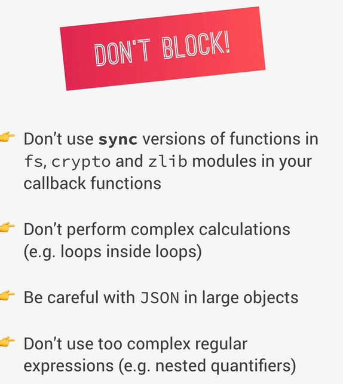

# Reglas para no bloquear el Event Loop de Node.js



Si se bloquea toda la aplicación se detienen los procesos.

Ejemplo:

- no responde HTTP

- no procesa callbacks

- no maneja requests

- no ejecuta timers

# 1. No usar versiones `sync` de fs, `crypto` y `zlib`

Muchos módulos de Node tienen dos versiones:

## 1.1 Async (buena)

``` javascript
fs.readFile("file.txt", (err, data) => {
  console.log(data);
});
```

Esto:

- inicia la operación

- Node sigue trabajando

- cuando termina → ejecuta **callback**

**No bloquea el Event Loop**

## 1.2 Sync (mala en servidores)

``` javascript
const data = fs.readFileSync("file.txt");
console.log(data);
```
```
Esto hace:

Node espera
Node espera
Node espera
Node espera
```

Mientras tanto:

- no se procesan requests

- no se ejecutan callbacks

- el servidor se congela

**Por eso en servidores casi nunca se usan las versiones `sync`.**


# 2. No hacer cálculos pesados

Ejemplo malo:

``` javascript
for (let i = 0; i < 1000000000; i++) {
  for (let j = 0; j < 1000000000; j++) {

  }
}
```

Esto bloquea el hilo por segundos o minutos.

Durante ese tiempo:

```
request HTTP → espera
request HTTP → espera
request HTTP → espera
```

El servidor parece caído.

**Soluciones:**

- usar **Worker Threads**

- dividir el trabajo

- usar servicios externos

# 3. Cuidado con JSON muy grande

Operaciones como:

``` javascript
JSON.parse()
JSON.stringify()

```
son sincrónicas.

Ejemplo:

``` javascript
const data = JSON.parse(hugeJson);
```

Si el `JSON` pesa `50MB`, **Node** se queda:

```
parseando...
parseando...
parseando...
```

- bloquea el **Event Loop**.

# 4. Regex muy complejas

Algunas expresiones regulares mal diseñadas pueden tardar muchísimo.

Ejemplo:

``` javascript
/(a+)+$/
```

Con ciertas cadenas produce algo llamado:

- **Catastrophic backtracking**

Esto puede congelar Node por segundos o minutos.

## IMPORTANTE

Los callbacks deben ser rápidos.

**Idealmente <1ms**

# Resumen

No hacer esto en **callbacks**:

- funciones Sync
- loops enormes
- JSON gigantes
- regex complejas

Porque bloquean el **Event Loop.**