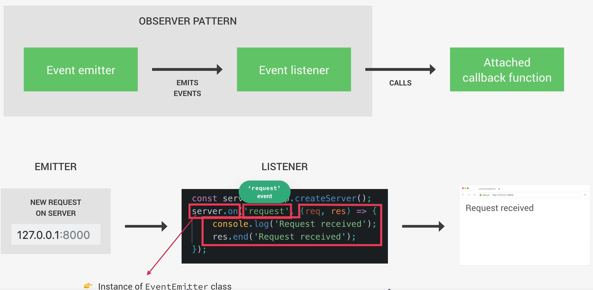

# Event Driven Arquitecture 
(Arquitectura basada en eventos)



# 1. Idea principal del Event-Driven Architecture

En este modelo:

- Algo **emite un evento**

- Algo **escucha ese evento**

- Cuando ocurre el evento, se ejecuta una **callback**

Flujo:

```
Event emitter → emite evento
Event listener → escucha el evento
Callback → función que se ejecuta
```

# 2. Parte de arriba del diagrama (Observer Pattern)

La imagen nos muestra:

```
Event emitter → Event listener → Callback
```

Esto significa:

1. **Emitter (emisor)**
Objeto que dispara eventos

2. **Listener (escuchador)**
Objeto que escucha eventos específicos

3. **Callback**
Función que se ejecuta **cuando ocurre el evento**

# 3. Ejemplo con el código del servidor

La imagen muestra esto:

``` javascript

const server = http.createServer();

server.on('request', (req, res) => {
  console.log('Request received');
  res.end('Request received');
});

```

Ahora vamos a relacionarlo con el diagrama.

# 4. Quién es cada cosa

## 4.1 Event Emitter

**El server**

``` javascript

const server = http.createServer();

```

Este objeto internamente usa **EventEmitter**.

## 4.2 Event

El evento es:

```

'request'

```

Este evento ocurre cuando **alguien hace una petición HTTP al servidor.**

Ejemplo en el navegador:

```
127.0.0.1:8000
```

Cuando entramos ahí, se dispara el evento.

## 4.3 Listener

El listener es:

``` javascript

server.on('request', ...)

```
`.on()` significa:

- "Escucha este evento"

## 4.4 Callback function

La función que pasamos:

``` javascript

(req, res) => {
  console.log('Request received');
  res.end('Request received');
}

```

Esta función se ejecuta cuando ocurre el evento.

# 5. Flujo completo del diagrama

Cuando alguien abre el navegador:

```

http://127.0.0.1:8000

```
Sucede esto:

**Paso 1**

El navegador manda un request HTTP

↓

**Paso 2**

El servidor emite el evento

```

'request'

```
↓

**Paso 3**

Node revisa:

```

¿Hay alguien escuchando este evento?

```

↓

**Paso 4**

Sí:

``` javascript

server.on('request', callback)


```
↓

**Paso 5**

Node ejecuta la callback

``` javascript

(req, res) => {
  console.log('Request received');
  res.end('Request received');
}

```

↓

**Paso 6**

El navegador recibe la respuesta

```

Request received

```

# 6. Por qué Node usa esto

Porque **Node** está diseñado para `I/O asíncrono`.

Entonces en lugar de hacer:

```

haz esto
espera
haz esto
espera

```
**Node** hace:

```

cuando pase esto → ejecuta esta función
cuando pase aquello → ejecuta esta otra

```

Es decir:

```

EVENTOS

```

# 7. Ejemplo simple fuera de HTTP

Así funciona internamente:

``` javascript

const EventEmitter = require('events');

const emitter = new EventEmitter();

emitter.on('saludo', () => {
  console.log('Hola!');
});

emitter.emit('saludo');

```

Resultado:

```

Hola!

```

Flujo:

```

emit('saludo') → dispara evento
on('saludo') → lo escucha
callback → se ejecuta

```

# 8. Resumen

En `Node.js` casi todo es **event-driven**.

Muchos objetos son `EventEmitters`:

- servers

- streams

- sockets

- process

- file system

Todos funcionan así:

```

evento ocurre
↓
listener lo detecta
↓
callback se ejecuta

```