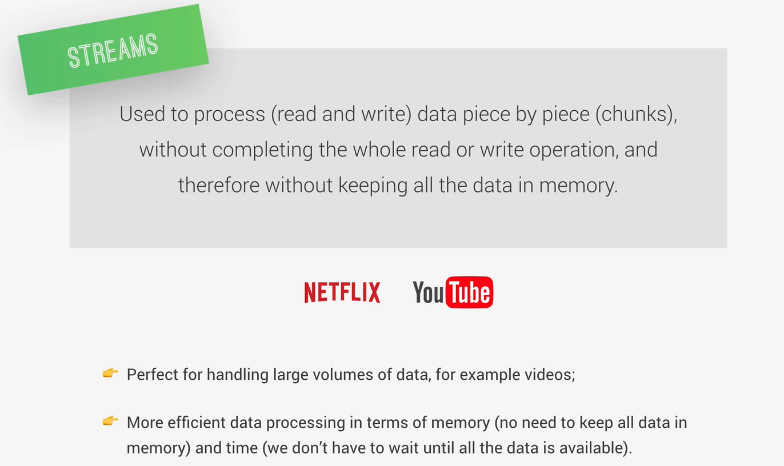
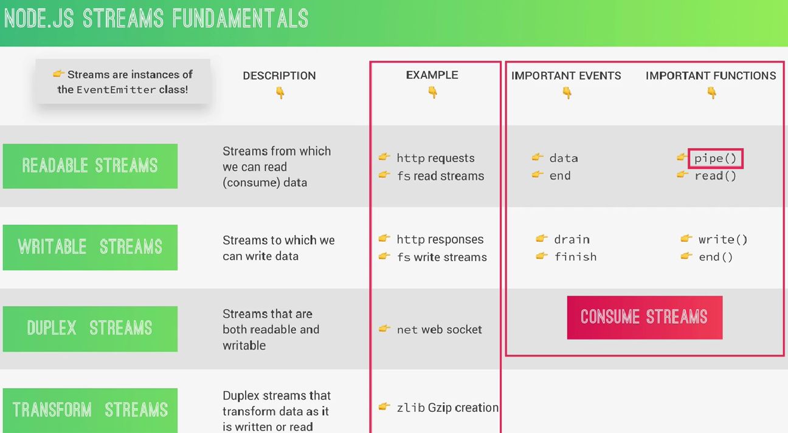

# Streams



Un **Stream** es un objeto que permite **leer o escribir datos poco a poco** (en **chunks**) en lugar de cargar todo en memoria.

Ejemplo:

📦 Archivo de 1GB

❌ Sin streams

- **Node** intenta cargar **1GB completo en memoria**

✅ Con streams

- **Node procesa pequeños pedazos (chunks)**

Esto hace que **Node** sea muy **eficiente para I/O.**

# 2. Streams son instancias de EventEmitter

La imagen nos dice que:

- Streams are instances of EventEmitter

Eso significa que los **streams emiten eventos.**

Ejemplo:

``` javascript

stream.on('data', chunk => {
  console.log(chunk);
});

```

Eventos típicos:

- `data`

- `end`

- `error`

- `finish`

- `drain`

# 3. Tipos de Streams en Node.js

Node tiene **4 tipos principales**.

## 3.1 Readable Streams

Streams de los que podemos **leer** datos.

Ejemplos:

- HTTP request

- Leer archivos

``` javascript

const fs = require("fs");

const stream = fs.createReadStream("archivo.txt");

stream.on("data", chunk => {
  console.log(chunk.toString());
});

stream.on("end", () => {
  console.log("terminó");
});

```

Eventos importantes:

- `data`

- `end`

Funciones importantes:

- `read()`

- `pipe()`

## 3.2 Writable Streams

Streams a los que podemos **escribir** datos.

Ejemplo:

- HTTP response

- Escribir archivos

``` javascript

const fs = require("fs");

const stream = fs.createReadStream("archivo.txt");

stream.on("data", chunk => {
  console.log(chunk.toString());
});

stream.on("end", () => {
  console.log("terminó");
});

```

Eventos importantes:

- `drain`

- `finish`

Funciones:

- `write()`

- `end()`

## 3.3 Duplex Streams

Streams que son Readable y Writable al mismo tiempo.

Ejemplo típico:

- **Sockets**

``` javascript

net.Socket

```

Podemoss:

- leer datos

- escribir datos

al mismo tiempo.

## 3.4 Transform Streams

Son **Duplex streams que transforman los datos**.

Ejemplo clásico:

- compresión

- encriptación

Ejemplo con gzip:

``` javascript

const zlib = require("zlib");

```
Transforma datos mientras pasan por el stream.

# 4. La función más importante: `pipe()`

En la imagen está marcada porque es la **forma más común de usar streams.**


`pipe()` conecta streams.

Ejemplo:

``` javascript

const fs = require("fs");

const readStream = fs.createReadStream("input.txt");
const writeStream = fs.createWriteStream("output.txt");

readStream.pipe(writeStream);

```
Flujo:

```

archivo.txt
     ↓
Readable Stream
     ↓
pipe()
     ↓
Writable Stream
     ↓
output.txt

```

**Node** maneja automáticamente:

- chunks

- backpressure

- eventos

# 5. Por qué Streams son tan importantes en Node

Node los usa en casi todo:

| Sistema         | Usa Streams              |
| --------------- | ------------------------ |
| HTTP            | request / response       |
| File System     | readStream / writeStream |
| TCP             | sockets                  |
| compression     | zlib                     |
| video streaming | streams                  |


Por eso Node es **muy bueno manejando I/O pesado**.

# 6. Cómo se conecta esto con el Event Loop

Los streams:

- **no bloquean el event loop**

- funcionan con **eventos y callbacks**

- procesan **chunks asincrónicamente**

Esto es exactamente el **modelo de Node.**

# Resumen

```

Readable → produce datos
Writable → consume datos
Duplex → produce y consume
Transform → modifica datos

```