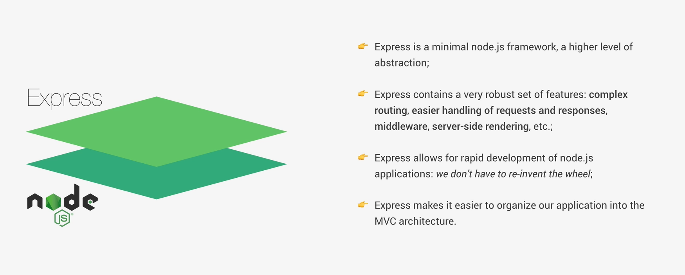

# Express



Es un framework encima de **Node.js** que nos facilita crear servidores y APIs.

- **Sin Express:** Nosotros manejamos todo manualmente (rutas, headers, requests…).

- **Con Express:** Ya tenemos herramientas listas para eso.

## Explicación  de cada punto

### 1. “Minimal framework, higher level of abstraction”

- **Minimal** = No nos obliga a usar una estructura rígida.

- **Higher level of abstraction** = Nos ahorra trabajo complicado.

 #### Ejemplo:

En Node puro:

``` javascript

http.createServer((req, res) => { ... })

```

En Express:

``` javascript

app.get('/', (req, res) => {
  res.send('Hola')
})

```

- Es mucho más simple.

### 2. “Robust set of features”

Express nos da cosas clave ya resueltas:

- **Routing (rutas)** → app.get(), app.post()

- **Request & Response más fáciles** → req, res

 - **Middleware** → funciones que se ejecutan en medio

- S**erver-side rendering** → puedes renderizar vistas

#### Ejemplo de middleware:

``` javascript

app.use((req, res, next) => {
  console.log('Petición recibida')
  next()
})

```

### 3. “Rapid development”

- Significa: desarrollo más rápido

Porque:

- No tenemos que reinventar lógica básica

- Hay miles de paquetes compatibles

- Código más corto y claro

### 4. “MVC architecture”

Express facilita organizar una app así:

- Model → datos (DB)

- View → lo que ve el usuario

- Controller → lógica

#### Ejemplo simple:

```

/routes
/controllers
/models

```

## En resumen

Express es como un “kit de herramientas” para **Node.js**:

- Simplifica el manejo del servidor

- Da estructura sin obligarnos demasiado
 
- Permite escalar proyectos fácilmente

# MÉTODOS

Estos son los que usamos en el servidor principal:

## 1. Rutas HTTP

``` javascript
app.get()
app.post()
app.put()
app.delete()
app.patch()
```

- Sirven para manejar requests según el método HTTP.

Ejemplo:

``` javascript
app.get('/usuarios', (req, res) => {})
app.post('/usuarios', (req, res) => {})
```

## 2. Middleware

``` javascript
app.use()
```

- Para aplicar *middleware* global o por rutas

``` javascript
app.use(express.json())
```

## 3. Configuración

``` javascript
app.set()
app.get() // también sirve para obtener config
```

Ejemplo:

``` javascript
app.set('port', 3000)
```

## 4. Levantar servidor

``` javascript
app.listen()
app.listen(3000, () => {
  console.log('Servidor corriendo')
})
```

# Objeto `req` (request)

Representa la petición que llega

- Propiedades comunes

``` javascript
req.body        // datos enviados (POST)
req.params      // parámetros de la URL
req.query       // query strings
req.headers     // headers
req.method      // GET, POST...
req.url         // ruta
```

Ejemplo:

``` javascript
app.get('/user/:id', (req, res) => {
  console.log(req.params.id)
})
```

# Objeto `res` (response)

Es lo que usamos para responder

- Métodos más usados

``` javascript
res.send()
res.json()
res.status()
res.sendStatus()
res.redirect()
res.render()
```

# Ejemplos claros

## 1. Enviar texto

``` javascript
res.send('Hola')
```

## 2. Enviar JSON

``` javascript
res.json({ nombre: 'Juan' })
```
## 3. Status + respuesta

``` javascript
res.status(200).json({ ok: true })
```
## 4. Solo status

``` javascript
res.sendStatus(404)
```

## 5. Redirigir

``` javascript
res.redirect('/login')
```

# Resumen de Métodos

- `app` → define rutas

- `req` → trae datos

- `res` → envía respuesta

- `middleware` → ejecuta lógica intermedia