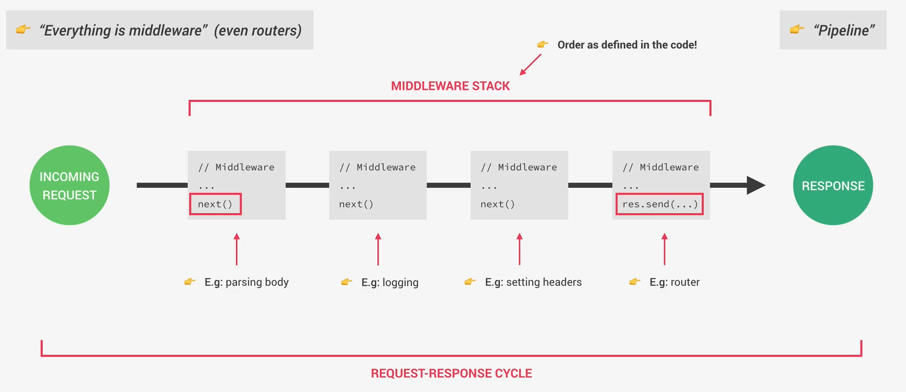

# 1. Middleware



Es una función que se ejecuta **entre la petición (request) y la respuesta (response)**

## Forma típica

``` javascript

(req, res, next) => { ... }

```

- `req` → lo que llega

- `res` → lo que se va a responder

- `next` → pasa al siguiente middleware

### Ejemplo

``` javascript

const logger = (req, res, next) => {
  console.log("Alguien hizo una petición")
  next()
}

```

# 2. Request-Response Cycle (ciclo)

Es el recorrido de una petición:

```

Cliente → Middleware → Middleware → Ruta → Respuesta

```

### Ejemplo

``` javascript

app.use(logger)

app.get('/usuarios', (req, res) => {
  res.send("Lista de usuarios")
})

```

Flujo:

- llega request

- pasa por `logger`

- llega a la ruta

- responde

# 3. Middleware Stack (la pila)

Es el orden en que se ejecutan los **middlewares**

MUY importante:

- Se ejecutan en el orden en que se les define en el código.

### Ejemplo

``` javascript

app.use((req, res, next) => {
  console.log("Middleware 1")
  next()
})

app.use((req, res, next) => {
  console.log("Middleware 2")
  next()
})

app.get('/', (req, res) => {
  res.send("Hola")
})

```
### Resultado

```

Middleware 1
Middleware 2

```

- Y luego responde.

# 4. IMPORTANTE: `next()`

Si NO hacemos el llamado de `next()`:

``` javascript

(req, res, next) => {
  console.log("Hola")
}

```
- ❌ La request se queda **“colgada”**

# 5. Tipos de middleware

## 5.1 Global

``` javascript

app.use(logger)

```

- Se ejecuta en TODAS las rutas.

## 5.2 Por ruta

``` javascript

app.get('/perfil', auth, (req, res) => {
  res.send("Perfil")
})

```

- Solo en esa ruta

## 5.3 Built-in (ya vienen con Express)

``` javascript

app.use(express.json())

```

- Permite leer `JSON` del body.

## 5.4 De error

``` javascript

app.use((err, req, res, next) => {
  res.status(500).send("Error")
})

```

- Maneja errores

## Ejemplo real

``` javascript

const auth = (req, res, next) => {
  if (req.headers.authorization) {
    next()
  } else {
    res.status(401).send('No autorizado')
  }
}

```

Esto es lo que hace:

- revisa si hay token

- si sí → sigue (`next()`)

- si no → corta y responde

Esto es un middleware

## Resumen

- **Middleware** = función entre request y response

- `next()` = pasar al siguiente

- ***Stack*** = orden en el código

- **Ciclo** = flujo completo de la petición

