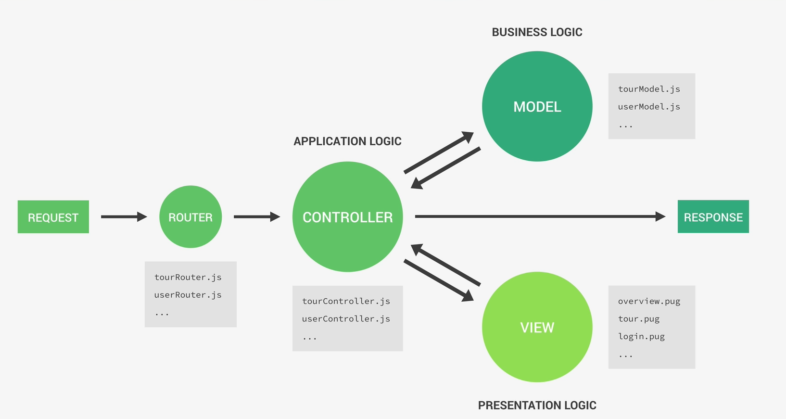

# MVC = Model + View + Controller

Es una forma de organizar el código para que cada parte tenga una responsabilidad clara.



## Flujo

```

REQUEST → ROUTER → CONTROLLER → MODEL / VIEW → RESPONSE

```

# 1. 🟢 REQUEST (petición)

El usuario hace algo:

- entra a `/users`

- envía un formulario

- pide datos

# 2. 🟡 ROUTER (rutas)

Archivo tipo:

``` javascript

// userRouter.js
router.get('/users', getUsers)

```
El router decide:

- "Si alguien pide `/users`, llama a este controller"

# 3. 🔵 CONTROLLER

Archivo tipo:

``` javascript

// userController.js
exports.getUsers = async (req, res) => {
  const users = await User.find()
  res.json(users)
}

```
El controller:

- recibe la request

- decide qué hacer

- habla con el Model

- manda la respuesta

Es el intermediario entre todo

# 4. 🟣 MODEL (datos / lógica de negocio)

Archivo tipo:

``` javascript

// userModel.js
const userSchema = new mongoose.Schema({
  name: String,
  email: String
})

```

El model:

- representa los datos (MongoDB)

- define reglas (`required`, `unique`, etc.)

- hace queries (`find`, `save`, etc.)

Es la parte que usa Mongoose

# 5. 🟢 VIEW (opcional)

Archivos tipo:

```

overview.pug
login.pug

```

Solo se usa si se renderiza HTML (no en APIs puras)

- muestra datos al usuario

- recibe info del controller

# 6. 🔁 RESPONSE

El controller responde:

``` javascript

res.json(data)
res.send()
res.render()

```

# Cómo se conecta todo

## ¿por qué tanta separación?


| Parte      | Se encarga de |
| ---------- | ------------- |
| Router     | rutas         |
| Controller | lógica        |
| Model      | datos         |
| View       | interfaz      |


Cada archivo hace **una sola cosa** bien.

# Importante (muy común en Node)

Si hacemos una API REST:

- casi no usamos View

- solo:

    - Router

    - Controller
    
    - Model

# Conexión

Esto conecta con los temas anteriores

- **Middleware** → ocurre entre router y controller

- **Mongoose** → vive en el Model

- **Controllers** → ya los mencionaste antes

- **Request/Response cycle** → esto ES el ciclo

