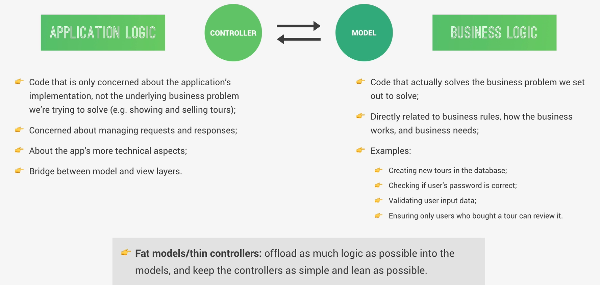

# Application Logic vs Business Logic



# 1. 🟢 Application Logic (Controller)

👉 Es cómo funciona la app técnicamente

Incluye:

- manejar `req` y `res`


- decidir qué función llamar

- estructurar la respuesta

- middleware, rutas, etc.

**No le importa el negocio, solo el flujo técnico.**

###  Ejemplo

``` javascript

exports.getUsers = async (req, res) => {
  const users = await User.getAllUsers()
  res.status(200).json({
    status: 'success',
    data: users
  })
}

```

Aquí:

- recibe request

- llama al model

- responde

Eso es **application logic.**

# 2. 🔵 Business Logic (Model)

Son las reglas del negocio

Responde preguntas como:

- ¿puede el usuario hacer esto?

- ¿cómo se valida esto?

- ¿qué condiciones deben cumplirse?

**Esto es lo importante de verdad para la empresa/app.**

### Ejemplos reales (como en la imagen):

- Validar contraseña

- Crear un tour

- Verificar permisos

- Validar datos

- Reglas como:

    - "solo usuarios que compraron pueden dejar review"

# 3. Diferencias

| Tipo              | Se enfoca en       |
| ----------------- | ------------------ |
| Application Logic | cómo corre la app  |
| Business Logic    | reglas del negocio |

# 4. Fat Models vs Thin Controllers

## ❌ Mal enfoque (lo común al inicio)

Controller haciendo todo:

``` javascript

exports.login = async (req, res) => {
  const user = await User.findOne({ email: req.body.email })

  if (!user) return res.status(404).send('No existe')

  const isCorrect = await bcrypt.compare(req.body.password, user.password)

  if (!isCorrect) return res.status(401).send('Incorrecto')

  res.send('Login exitoso')
}

```

Problema:

- controller gigante

- difícil de mantener

- lógica mezclada

## ✅ Buen enfoque (Fat Model / Thin Controller)

Controller (simple):

``` javascript

exports.login = async (req, res) => {
  const user = await User.login(req.body.email, req.body.password)

  res.status(200).json({
    status: 'success',
    user
  })
}

```

Model

``` javascript

userSchema.statics.login = async function(email, password) {
  const user = await this.findOne({ email })

  if (!user) throw new Error('Usuario no existe')

  const isCorrect = await bcrypt.compare(password, user.password)

  if (!isCorrect) throw new Error('Password incorrecto')

  return user
}

```

## ¿Qué significa “Fat Model”?

El model tiene:

- validaciones

- reglas

- lógica importante

## ¿Qué significa “Thin Controller”?

El controller solo:

- recibe datos

- llama funciones

- responde

## Esto conecta con:

- **Mongoose** → aquí vive el business logic

- **Middleware** → ayuda a limpiar controllers

- **MVC** → separación de responsabilidades

# CLAVE

**Los controllers coordinan, los models deciden**

Cuando escribamos código, nos podemos hacer esta pregunta:

**“¿Esto es una regla del negocio?”**

- ✔ **Sí** → va en el Model

- ❌ **No** → va en el Controller