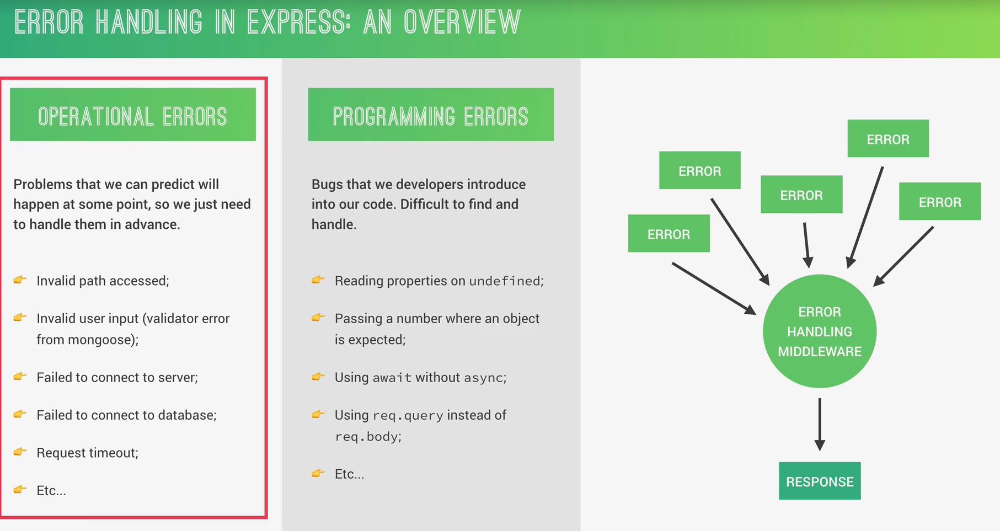

# Manejo de Errores en Express



# Tipos de errores

## 🟢 1. Operational Errors (errores operacionales)

Son errores esperados (normales en producción)

Ejemplos:

- Ruta no existe (404)

- Usuario envía datos inválidos

- Password incorrecto

- No hay conexión a la DB

- Token inválido

Son errores que:
- sí debemoss manejar y responder al usuario

## 🔴 2. Programming Errors (errores de programación)

Son bugs nuestros como desarrolladores

Ejemplos:

- `undefined.something`

- olvidar `await`

- usar mal `req.body`

- lógica incorrecta

Estos:

- No deberíamos intentar “arreglarlos” en runtime

- Debemos corregir el código

## Diferencia

| Tipo              | ¿Se maneja? | ¿Se puede recuperar? |
| ----------------- | ----------- | -------------------- |
| Operational Error | ✅ Sí        | ✅ Sí                 |
| Programming Error | ❌ No        | ❌ No                 |


# 2. ¿Cómo maneja errores Express?

Con middleware de errores

### 🟣 Middleware normal

``` javascript

(req, res, next)

```
### 🔴 Middleware de error

``` javascript

(err, req, res, next)

```

- Ese primer parámetro `err` lo hace especial.

## Ejemplo Middelware global

``` javascript

app.use((err, req, res, next) => {
  err.statusCode = err.statusCode || 500;
  err.status = err.status || 'error';

  res.status(err.statusCode).json({
    status: err.status,
    message: err.message
  });
});

```

## Líne por línea

### 1. Default status code

``` javascript

err.statusCode = err.statusCode || 500;

```

Si el error no tiene código:

- usa **500 (Internal Server Error)**

### 2. Default status

``` javascript

err.status = err.status || 'error';

```
Si no se define el estado:

- usa `"error"`

### 3. Enviar respuesta

``` javascript

res.status(err.statusCode).json({
  status: err.status,
  message: err.message
});

```
Devuelve un JSON como:

``` json
{
  "status": "error",
  "message": "Usuario no encontrado"
}

```

## ¿Por qué es importante?

Porque:

- Centraliza errores

- Evita repetir código

- Mantiene **controllers** limpios **(thin controllers)**

- Hace la API consistente

## IMPORTANTE

Este middleware SIEMPRE debe ir al FINAL:

``` javascript

// 1. rutas normales
app.use('/api/users', userRouter);

// 2. ruta no encontrada
app.all('*', (req, res, next) => {
  const err = new Error(`Can't find ${req.originalUrl} on this server!`);
  err.status = 'fail';
  err.statusCode = 404;

  next(err);
});

// 3. error global (siempre al final)
app.use((err, req, res, next) => {
  err.statusCode = err.statusCode || 500;
  err.status = err.status || 'error';

  res.status(err.statusCode).json({
    status: err.status,
    message: err.message
  });
});

```

## Flujo

### 1. 👤 Usuario entra a una ruta que NO existe

```

GET /ruta-que-no-existe

```

### 2. Express no encuentra coincidencia

Entonces entra aquí:

``` javascript

app.all('*', ...)

```

### 3. Se crea el error

``` javascript

new Error(...)

```

Le agregamos:

- `statusCode` = `404`

- `status` = `'fail'`

### 4. 🚀 Lo mandas al siguiente middleware

``` javascript

next(err)

```

Esto es clave:

- No respondemos aquí, lo delegamos al middleware global

### 5. Llega al error global

``` javascript

app.use((err, req, res, next) => {
  ...
})

```

### 6. 📤 Se responde al cliente

``` json

{
  "status": "fail",
  "message": "Can't find /ruta-que-no-existe on this server!"
}

```

### ¿Por qué no hacemos `res.json()` ahí mismo?

Aquí está la diferencia importante:

#### ❌ Mal enfoque

``` javascript

app.all('*', (req, res) => {
  res.status(404).json({ message: 'No existe' });
});

```

Problema:

- Se rompe la centralización

- Lógica repetida

- Inconsistente

#### ✅ Buen enfoque (el que estamos viendo)

``` javascript

next(err);

```

Ventajas:

- todo pasa por el mismo lugar

- puedemos formatear errores igual

- más escalable

## Resumen

- `app.all('*')` → detecta error

- `new Error()` → crea error

- `next(err)` → lo envía

- `error middleware` → responde

## Clave

Nunca responder aquí, siempre pasa el error con `next()`