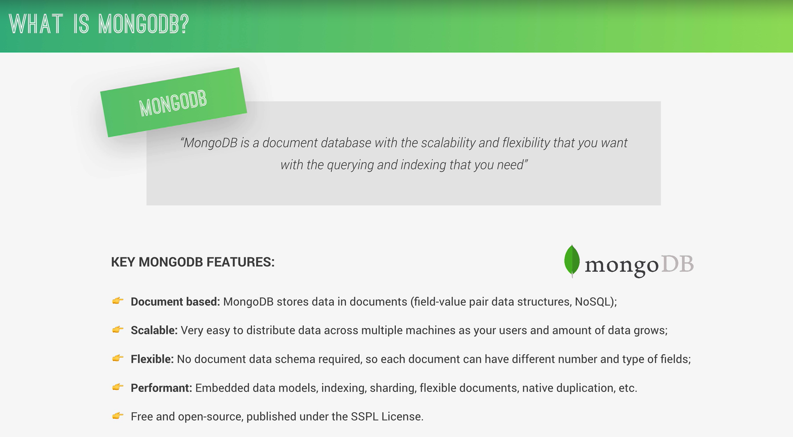

# MongoDB



MongoDB es una base de datos, pero diferente a las tradicionales como MySQL.

En lugar de guardar datos en tablas con filas y columnas, MongoDB guarda datos como documentos tipo JSON.

MongoDB guarda información así:

```

{
  "nombre": "Bryan",
  "edad": 25,
  "email": "bryan@email.com"
}

```

- A esto se le llama un documento.

# Explicación de lo que te muestra la imagen

## 1. Document based (basado en documentos)

- No usa tablas como SQL

- Usa documentos parecidos a JSON (BSON)

- Más fácil de trabajar en **Node.js** porque JavaScript usa objetos

## 2. Scalable (escalable)

- Puede crecer fácilmente

- Si tenemos muchos usuarios, podemos repartir los datos en varios servidores

Ejemplo:

- Hoy tenemos 100 usuarios → funciona normal

- Mañana tenemos 1 millón → MongoDB se adapta

## 3. Flexible
No necesitamos definir una estructura fija

En SQL:

```

tabla usuarios (nombre, edad)

```

En MongoDB podemos tener:

```

{ "nombre": "Bryan" }
{ "nombre": "Ana", "edad": 30 }

```

- Cada documento puede ser diferente.

## 4. Performant (rápido)

- Optimizado para leer/escribir rápido

- Usa cosas como:

    - índices

    - sharding (dividir datos)

    - replicación

## 5. Open source

Es gratis y muy usado en la industria

# ¿Por qué se usa tanto con Node.js?

Porque:

- Node trabaja con JavaScript

- MongoDB guarda datos en formato parecido a JavaScript (**JSON/BSON**)

Así que todo encaja perfecto.

# Resumen

**MongoDB es una base de datos flexible que guarda datos como objetos JSON en lugar de tablas.**