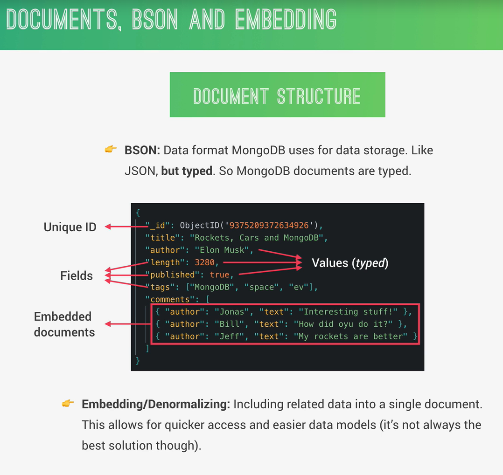

# Estructura de Docimentos



## 1. ¿Qué es BSON?

MongoDB NO guarda JSON directamente, usa algo llamado:

- BSON (Binary JSON)

### Idea simple:

- JSON → lo que nosotros vemos/escribimos

- BSON → cómo MongoDB lo guarda internamente

## 2. Diferencia importante

JSON:

```

{ "edad": 25 }

```

BSON:

- Guarda el tipo de dato

- Ej: número, string, boolean, fecha, etc.

Por eso dicen en la imagen:

- **"Like JSON, but typed"**

## 3. ¿Por qué importa?

Porque **MongoDB** sabe exactamente qué tipo es cada valor:

- `"edad": 25` → número

- `"nombre": "Bryan"` → string

- `"activo": true` → boolean

Eso lo hace más eficiente para buscar y filtrar

## 4. Estructura de un documento

Ejemplo basado en la imagen:

``` json

{
  "_id": ObjectId("9375209372634926"),
  "title": "Rockets, Cars and MongoDB",
  "author": "Elon Musk",
  "length": 3280,
  "published": true,
  "tags": ["MongoDB", "space", "ev"],
  "comments": [
    { "author": "Jonas", "text": "Interesting stuff!" },
    { "author": "Bill", "text": "How did you do it?" }
  ]
}

```

### 4.1 Partes importantes

#### 4.1.1 `_id` (ID único)

- MongoDB lo crea automáticamente

- Es como la **primary key** en SQL

#### 4.1.2 Fields (campos)

Son pares clave → valor

Ej:

``` json

"title": "Rockets"

```

#### 4.1.3 Values typed (valores con tipo)

- string

- number

- boolean

- array

- object

## 5. Documentos embebidos (Embedded documents)

Esto es lo MÁS importante de esta diapositiva

Miremos esto:

``` json

"comments": [
  { "author": "Jonas", "text": "Interesting stuff!" },
  { "author": "Bill", "text": "How did you do it?" }
]

```

Aquí tenemos documentos dentro de otro documento

### ¿Qué significa?

En vez de hacer otra tabla/colección para comentarios…

- Los metemos dentro del mismo documento

## Comparación con SQL

En SQL:

- tabla posts

- tabla comments

- relación con JOIN

En MongoDB todo va junto:

```

post + comments dentro del mismo documento

```

## 6. 4. Embedding (Denormalización)

Significa:

- Guardar datos relacionados juntos en un solo documento.

### Ventajas

Más rápido (no necesitamos hacer joins)

- Más simple

- Menos consultas

### Desventajas

- Puede crecer demasiado el documento

- No siempre es buena idea

### Ejemplo

``` javascript

app.get('/posts/:id', async (req, res) => {
  const post = await db.collection('posts').findOne({ _id: id })
  res.json(post)
})

```

MongoDB ya te devuelve:

- el post

- los comentarios

Todo en una sola consulta

## Resumen

- BSON = JSON pero optimizado y con tipos

- Documento = objeto con campos

- Embedded = objetos dentro de objetos

- Embedding = guardar todo junto en vez de separar

