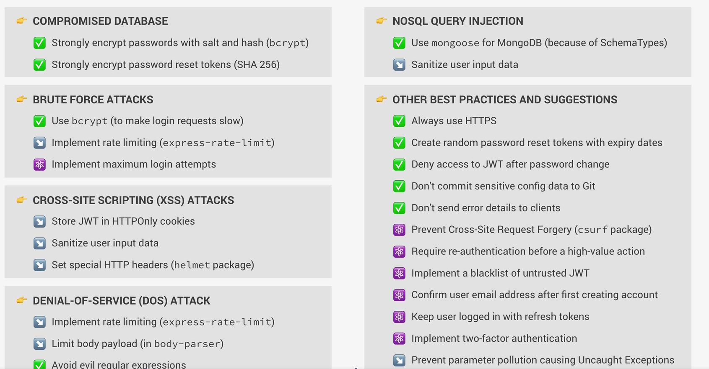

# Buenas prácticas



# 1. Compromised Database

- ¿Qué pasa si alguien roba mi base de datos?

La idea es minimizar el daño.

## bcrypt → proteger passwords

Cuando un usuario se crea una cuenta:

❌ MAL:

``` javascript

password: '123456'

```

✅ BIEN:

``` javascript

password: '$2b$10$asdfasdfasdf...'

```

Con bcrypt:

``` javascript

const bcrypt = require('bcryptjs');

const hashedPassword = await bcrypt.hash(password, 12);

```

## ¿Qué hace bcrypt?

Hace 2 cosas:

### 1. Hash

Convierte el password en texto irreconocible.

```

123456
↓
$2b$10$asjdhajshd...

```

### 2. Salt

Agrega información aleatoria antes del hash.

Entonces:

```

123456

```

- no siempre genera el mismo hash.

Eso evita ataques usando tablas precalculadas (“rainbow tables”).

### ¿Por qué no puedo desencriptar el hash?

Porque **bcrypt** no es cifrado reversible.

Es una función hash.

El login funciona así:

```

Usuario escribe password
↓
bcrypt hashea ese password otra vez
↓
compara hashes
↓
si coinciden → login válido

```

### Password reset tokens con SHA256

Cuando hacemos “Forgot password”:

```

Enviar link:
https://app.com/reset/abc123

```

Ese token NO se guarda plano en DB.

Se guarda hasheado:

``` javascript

crypto
  .createHash('sha256')
  .update(resetToken)
  .digest('hex');

```

Porque si alguien roba la DB no puede usar los tokens.

# 2. NoSQL Query Injection

Similar al SQL Injection pero en MongoDB.

### Ataque

Mongo usa objetos:

``` javascript

User.findOne({
  email,
  password
});

```

Un atacante podría mandar:

``` javascript

{
  "email": {
    "$gt": ""
  }
}

```

Y alterar el query.

### ¿Por qué Mongoose ayuda?

Porque usa **schemas**:

``` javascript

const userSchema = new mongoose.Schema({
  email: String
});

```

Entonces restringe tipos y comportamiento.

## Sanitizar input

Eliminar operadores peligrosos como:

```

$gt
$ne
$where

```

Muchas apps usan middleware como:

``` bash

npm install express-mongo-sanitize

```

``` javascript

const mongoSanitize = require('express-mongo-sanitize');

app.use(mongoSanitize());

```

# 3. Brute Force Attacks

Intentar miles de passwords automáticamente.

**bcrypt ayuda aquí también**

Porque hashing es lento intencionalmente.

Entonces:

```

1 login = costoso

```

Eso hace más lento probar millones de passwords.

# 4. Rate limiting

Limitar requests por IP.

Ejemplo:

``` bash

npm install express-rate-limit

```

``` javascript

const rateLimit = require('express-rate-limit');


const limiter = rateLimit({
  max: 100,
  windowMs: 60 * 60 * 1000,
  message: 'Too many requests'
});

app.use('/api', limiter);

```

### ¿Qué hace?

```

IP X hizo 100 requests
↓
bloqueada temporalmente

```

Muy útil para:

- login

- reset password

- APIs públicas

### Máximo de intentos login

Ejemplo:

```

5 passwords incorrectos
↓
bloquear cuenta 15 minutos

```

# 5. XSS (Cross-Site Scripting)

Inyectar JavaScript malicioso.

Ejemplo:

``` HTML

<script>alert('hack')</script>

```

### HTTPOnly cookies

En vez de guardar JWT en localStorage:

❌

``` javascript

localStorage.setItem('jwt', token);

```

✅

``` javascript

res.cookie('jwt', token, {
  httpOnly: true
});

```

### ¿Por qué?

- Porque JS del navegador NO puede leer cookies HTTPOnly.

- Entonces un ataque XSS no puede robar el JWT fácilmente.

## helmet

Middleware que agrega headers de seguridad.

``` bash

npm install helmet

```

``` javascript

const helmet = require('helmet');

app.use(helmet());

```

Agrega cosas como:

```

X-Frame-Options
Content-Security-Policy

```

Protege contra:

- XSS

- MIME sniffing

- clickjacking

    - Un atacante mete nuesrtro sitio dentro de un `<iframe>` invisible, y engaña al usuario para hacer clic.

Ejemplo:

``` html

<iframe src="https://tubanco.com"></iframe>

```

**Helmet agrega algo así:**

```

X-Frame-Options: SAMEORIGIN

```

Que significa:

```

“No permitas que otros sitios embeban esta página”

```
# 6. DOS Attack

Saturar el servidor con requests.

### Rate limiting otra vez

Protege contra spam masivo.

### Limitar body size

Evita que manden payloads gigantes.

``` javascript

app.use(express.json({
  limit: '10kb'
}));

```

### “Avoid evil regular expressions”

Algunas regex pueden congelar Node.js.

Ejemplo peligroso:

``` javascript

/(a+)+$/

```

Con ciertos inputs consume muchísimo CPU.

Esto se llama:

```

ReDoS
Regular Expression Denial of Service

```

# 7. Otras mejores prácticas

### HTTPS siempre

HTTP normal:

```

password = visible

```

HTTPS:

```

password = encriptado durante transmisión

```

# 8. No subir secretos a Git

❌

``` javascript

const password = '123456';

```

✅ usar `.env`

```

DATABASE_PASSWORD=abc123
JWT_SECRET=mysecret

```

Y:

```

.env

```

# 9. No enviar errores internos al cliente

❌

``` javascript

res.send(err);

```

Porque se expone:

- rutas internas

- stack trace

- queries

- estructura backend

### Mejor

``` javascript

res.status(500).json({
  status: 'error',
  message: 'Something went wrong'
});

```

# 10. Invalidar JWT después de cambiar password

Porque si alguien robó un token viejo:

```

usuario cambia password
↓
token viejo debería dejar de funcionar

```

Normalmente se guarda:

``` javascript

passwordChangedAt

```

y se compara con el JWT.

## 11. CSRF (Cross-Site Request Forgery)

Engañar al navegador para hacer requests autenticados.

Por eso existen:

- CSRF tokens

- SameSite cookies

## 12. 2FA

Código extra:

```

Password + código celular

```

Muy importante en apps reales.

## 13. HTTP Parameter pollution

### ¿Qué hace hpp?

Elimina parámetros duplicados.

### El problema

Un atacante puede mandar parámetros repetidos en la URL.

### Entonces protege contra:
HTTP Parameter Pollution attacks

Ejemplo:

```

/api/users?id=1&id=2

```

Puede romper lógica.

### ¿Por qué eso es peligroso?

Porque distintas partes de una app podrían interpretar valores distintos.

Por ejemplo:

``` javascript

req.query.role

```

podría terminar siendo:

``` javascript

['user', 'admin']

```

o solo:

```

admin

```

dependiendo de cómo Express procese los parámetros.

### Entonces un atacante intenta:

- romper lógica

- saltarse validaciones

- causar errores

- alterar filtros

Se usa:

``` bash

hpp

```

``` javascript

const hpp = require('hpp');

app.use(hpp());

```

### 13. 1 ¿Qué es la whitelist?

A veces si queremos permitir parámetros repetidos.

Especialmente para filtros.

Ejemplo

Quizá buscamos esto:

```

/api/tours?duration=5&duration=7

```

para buscar:

```

tours de 5 o 7 días

```

### Problema

`hpp` bloquearía duplicados.

### Solución → whitelist

``` javascript

app.use(hpp({
  whitelist: [
    'duration',
    'price'
  ]
}));

```

#### ¿Qué significa?

Estos parámetros sí pueden repetirse

Entonces:

**Permitido**

```

/api/tours?duration=5&duration=7

```

**Bloqueado**

```

/api/users?role=user&role=admin

```

### Resumen

**Sin hpp**

- El usuario controla completamente query params

**Con hpp**

- Solo permito duplicados específicos y seguros

# Stack completo típico en Express

``` javascript

app.use(helmet());

app.use(mongoSanitize());

app.use(xss());

app.use(hpp());

app.use(rateLimit({...}));

app.use(express.json({
  limit: '10kb'
}));

```