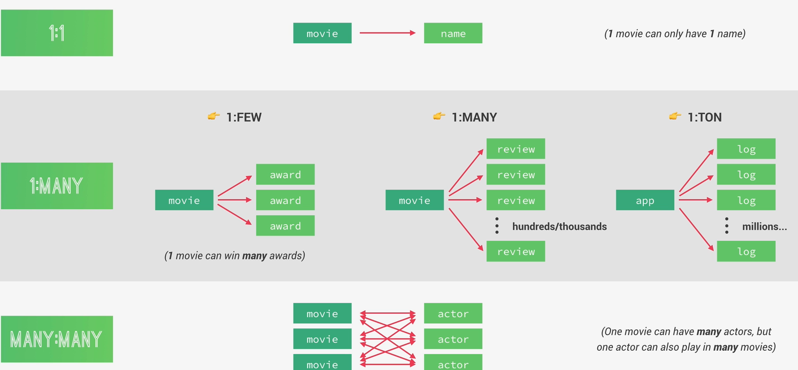

# Tipos de relaciones



La imagen habal sobre cómo se relacionan los datos.

## 🔹 1:1 (Uno a Uno)

### Ejemplo:

- Un usuario tiene 1 perfil

- Una película tiene 1 nombre

``` javascript

{
  title: 'Interstellar'
}

```

Normalmente esto se guarda en el mismo documento porque no tiene sentido separarlo.

## 🔹 1:MANY (Uno a Muchos)

### Ejemplo:

- Una película puede tener muchos premios

``` javascript

movie -> awards

```
o:

- Un post tiene muchos comentarios

### Pero aquí hay 3 tipos importantes

La imagen separa:

### 1:Few

Pocos elementos.

Ejemplo:

- Película → 3 actores principales

- suario → 2 direcciones

Aquí normalmente conviene:

#### ✅ EMBEDDING

``` javascript

{
  title: 'Interstellar',
  actors: [
    'Matthew',
    'Anne Hathaway'
  ]
}

```

Porque son pocos datos.

### 1:Many

Cientos o miles.

Ejemplo:

- Movie → reviews

- Usuario → notificaciones

Aquí ya depende del caso.

### 1:Ton

Millones.

Ejemplo:

- App → logs

- Sistema → eventos

Aquí:

- **❌ JAMÁS debemos embeber**

Porque el documento crecería muchísimo.

Aquí obligatoriamente usamos:

- **✅ REFERENCING**

## MongoDB tiene un límite:

- Un documento no puede pasar de 16MB

Entonces esto:

``` javascript

{
  app: 'Netflix',
  logs: [ ...2 millones de logs... ]
}

```

Eso explotaría el límite.

Por eso es importante lo de:

- child referencing

- parent referencing

Porque si metemos millones de `ObjectIds` en un array:

``` javascript

logs: [ObjectId(), ObjectId(), ObjectId()]

```

también el documento crece demasiado.