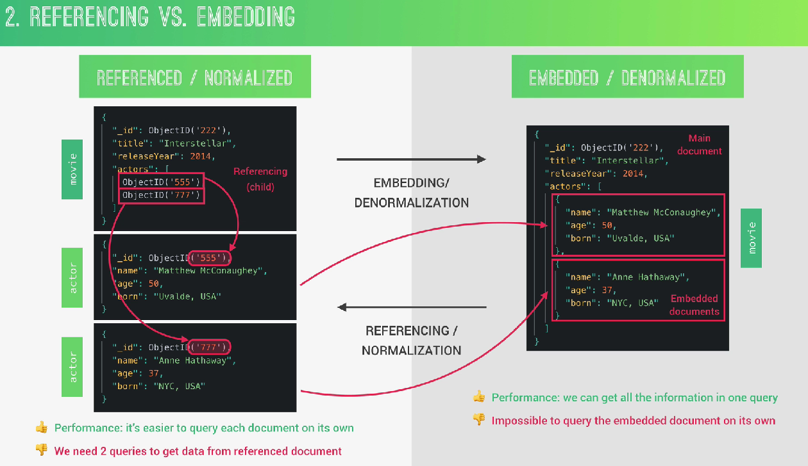
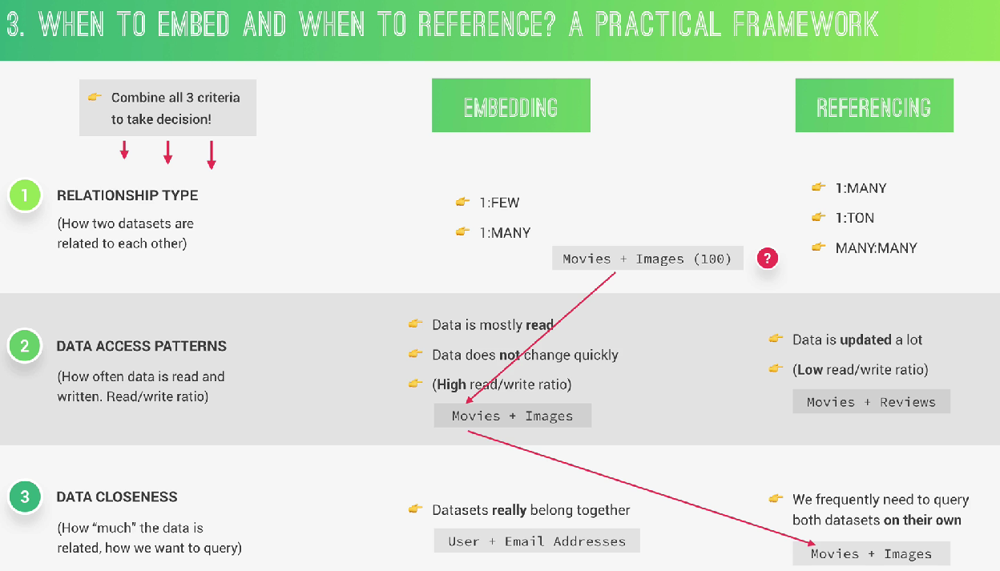

# Normalización y Denormalización



## 1. NORMALIZED (Referencing)

Guardar separados los documentos.

### Ejemplo

**Movie**

``` javascript

{
  title: 'Interstellar',
  actors: [
    ObjectId('555'),
    ObjectId('777')
  ]
}

```

**Actor**

``` javascript

{
  _id: '555',
  name: 'Matthew'
}

```

**Ventaja**

Podemos consultar actores individualmente

``` javascript

Actor.find()

```

- Los datos no se duplican

**Desventaja**

Necesitamos:

- populate()

- joins lógicos

- varias consultas

## 2. DENORMALIZED (Embedding)

Meter todo dentro del documento principal.

``` javascript

{
  title: 'Interstellar',
  actors: [
    {
      name: 'Matthew'
    },
    {
      name: 'Anne Hathaway'
    }
  ]
}

```

**Ventaja**

✅ Un solo query trae todo

- Más rápido para lectura.

**Desventaja**

❌ Duplicación de datos

Si Matthew cambia nombre:

``` javascript

Matthew -> Matt

```

- debemos actualizar todas las películas.

### Por ejemplo:

Si en otro película (documento) tenemos al mismo actor

``` javascript

{
  title: 'Dallas Buyers Club',
  actors: [
    {
      name: 'Matthew McConaughey',
      age: 50
    }
  ]
}

```

El actor **Matthew** está repetido en múltiples documentos.

O sea:

```

Matthew McConaughey

```

fue copiado:

- en Interstellar

- en Dallas Buyers Club

- en otra película

- etc.

Entonce si mañana **Matthew** cambia algo:

```

Matthew McConaughey -> Matt McConaughey

```

tendríamos que actualizar:

- Interstellar

- Dallas Buyers Club

- todas las demás películas

**Eso es duplicación de datos.**

El mismo dato existe en muchos lugares.

## 3. ¿Cuándo usar embedding o referencing?



**Regla general**

Modelar los datos según cómo la app los consulta

No según teoría SQL.

**MongoDB lo ve de esta manera:**

- ¿Cómo voy a leer esta información?

**No:**

- ¿Cómo se ve bonito el modelo?

## Los 3 criterios

### 1. Tipo de relación

**EMBEDDING**

- ✔ 1:Few

- ✔ 1:Many pequeños

**REFERENCING**

- ✔ 1:Ton

- ✔ Many:Many

### 2. Patrón de acceso

**EMBEDDING si:**

- se lee mucho

- cambia poco

Ejemplo:

``` javascript

Movie + images

```

- Las imágenes casi nunca cambian.

**REFERENCING si:**

- cambia mucho

- muchos writes

Ejemplo:

```

Movie + reviews

```

- Los reviews crecen constantemente.

## 3. Cercanía de los datos

Pregunta clave:

- ¿Estos datos realmente pertenecen juntos?

**EMBEDDING**

Ejemplo:

```

User + Address

```

- Tiene sentido que vivan juntos.

**REFERENCING**

Si necesitamos consultar ambos por separado.

Ejemplo:

```

Movies
Actors

```

Porque buscamos:

- todos los actores

- películas por actor