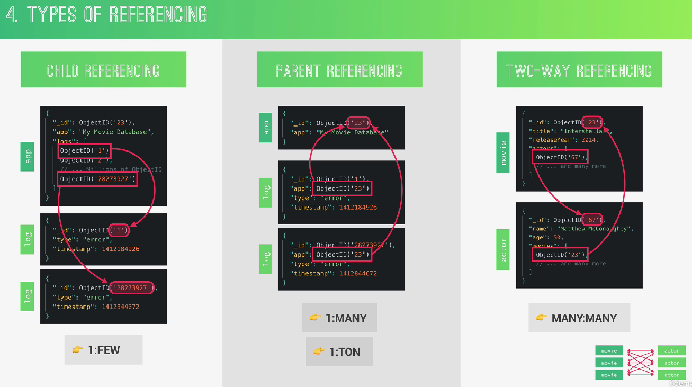
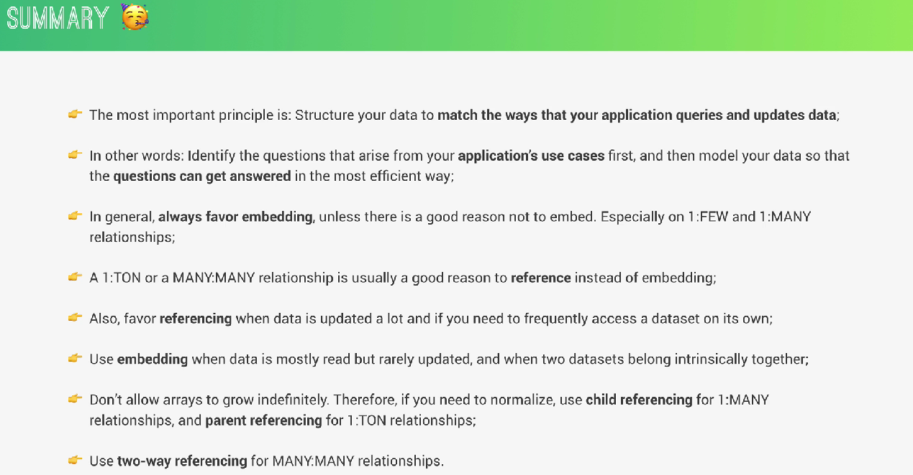

# Referencing



## 1. Child Referencing

El padre guarda IDs de hijos.

``` javascript

{
  app: 'Netflix',
  logs: [
    ObjectId('1'),
    ObjectId('2')
  ]
}

```

### ✅ 1:Few

- Porque el array es pequeño.

Malo para millones porque el documento crece infinito.

## 2. Parent Referencing

El hijo guarda referencia al padre.

``` javascript

{
  message: 'error',
  app: ObjectId('23')
}

```
Esto es PERFECTO para:

- ✅ 1:Ton

Porque 

- cada log vive separado

- el documento principal nunca crece

## 3. Two-way Referencing

Ambos se referencian.

Ejemplo

Movie:


``` javascript

actors: [actorId]


```

Actor:


``` javascript

movies: [movieId]

```

Usado para
- ✅ Many:Many

## Resumen entre embebidos y referencias

✅ EMBED si:

- pocos datos

- se leen juntos

- cambian poco

- pertenecen juntos

✅ REFERENCE si:

- muchísimos datos

- cambian mucho

- ecesitas consultar separado

- relación many-to-many

- el array puede crecer infinito

## IMPORTANTE

MongoDB:

- ❌ NO modela igual que SQL

En SQL:

- normalizar casi siempre

En MongoDB:

- Optimizar para lectura y uso real de la app.

## RESUMEN

